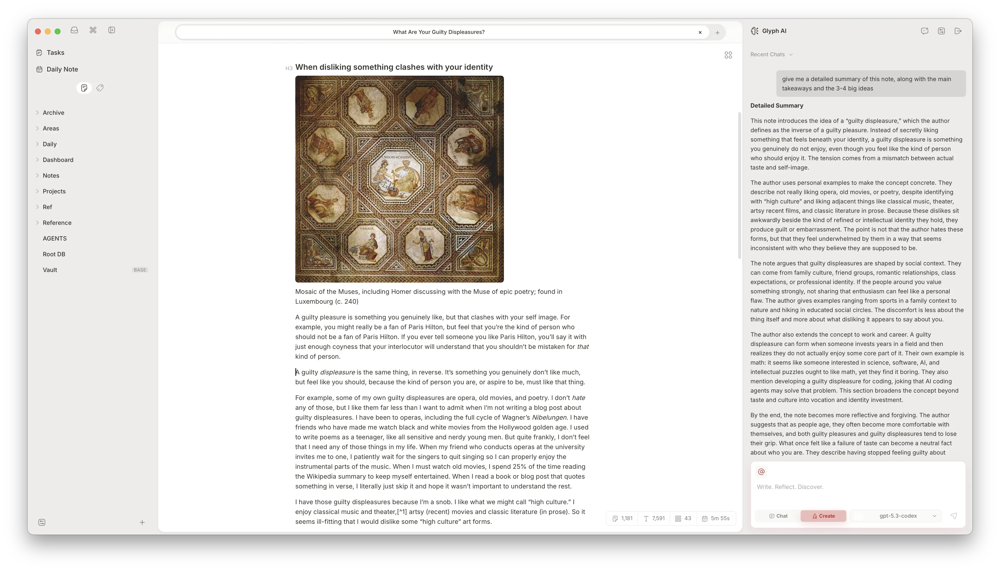

# Glyph

  

  Glyph is an offline-first desktop notes app for writing, organizing, and exploring ideas in Markdown.
   
  It combines a local-first workspace, fast search, and built-in AI tools in a Tauri desktop app powered by React, TypeScript, and Rust.

## Licensing

Glyph is open source, but official release binaries use a 48-hour trial plus Gumroad license activation.

- Official releases: [GitHub Releases](https://github.com/SidhuK/Glyph/releases)
- Purchase: [Gumroad](https://karatsidhu.gumroad.com/l/sqxfay)
- Details: [docs/licensing.md](docs/licensing.md)

## Development

- `pnpm dev` - frontend dev server
- `pnpm tauri dev` - full desktop app
- `pnpm build` - typecheck + production build
- `pnpm check` - lint/format checks
- `pnpm test` - frontend tests
- `cd src-tauri && cargo check` - Rust typecheck

## AI Providers

Glyph supports multiple AI providers in settings, including:
- OpenAI
- OpenAI-compatible
- OpenRouter
- Anthropic
- Gemini
- Ollama
- Codex (ChatGPT OAuth via Codex App Server)

## Codex App Server

Codex integration runs as a managed local app-server process through stdio JSON-RPC from the Tauri backend.

For implementation details and rollout checklist:
- `docs/codex-app-server-integration-checklist.md`

For troubleshooting:
- `docs/codex-app-server-troubleshooting.md`
