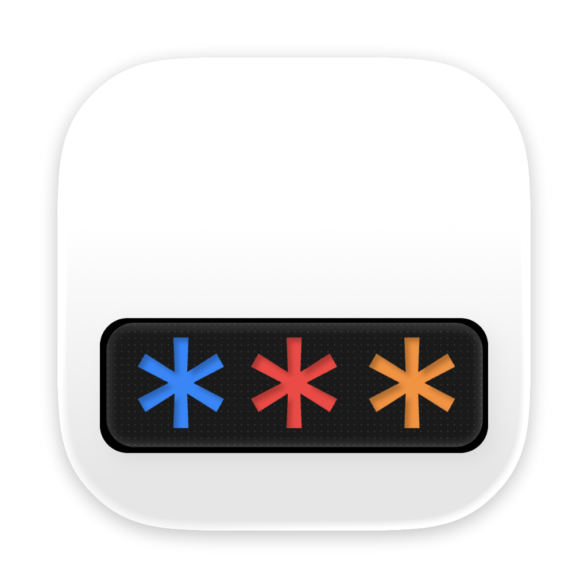
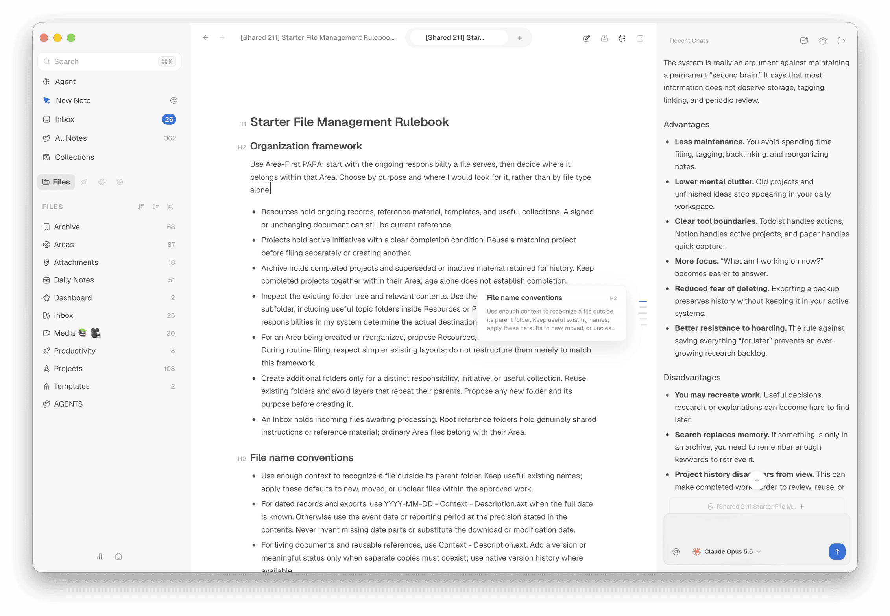

<p align="center">
  
</p>

<h1 align="center">Glyph</h1>

<p align="center">
  <strong>Offline-first notes for macOS</strong><br />
  Your notes are plain Markdown files on your Mac. Glyph makes them fast to write, search, and organize — no account, no server.
</p>

<p align="center">
  <a href="https://github.com/SidhuK/Glyph/releases/latest"></a>
  <a href="https://github.com/SidhuK/Glyph/releases"></a>
  <a href="https://github.com/SidhuK/Glyph/actions/workflows/pr-checks.yml"></a>
  <a href="LICENSE"></a>
</p>

<p align="center">
  <a href="https://github.com/SidhuK/Glyph/releases/latest"><strong>Download</strong></a> ·
  <a href="https://karatsidhu.gumroad.com/l/sqxfay"><strong>Buy a license</strong></a> ·
  <a href="https://discord.gg/cNqrBfFx7D"><strong>Discord</strong></a>
</p>



## Install

Glyph runs on Apple Silicon Macs.

**Homebrew**

```bash
brew install --cask sidhuk/glyph/glyph
```

**Manual:** download the latest `.dmg` from [GitHub Releases](https://github.com/SidhuK/Glyph/releases/latest) and drag Glyph into Applications. The app updates itself.

Official builds include a **7-day free trial**, after which a one-time license from [Gumroad](https://karatsidhu.gumroad.com/l/sqxfay) is required. The source code is AGPL-3.0, so you are also free to [build it yourself](#build-from-source).

## Features

- **Plain Markdown on disk** — every note is a `.md` file in a folder you choose. Open it in any other editor, back it up however you like, leave whenever you want.
- **Rich editor or raw source** — a WYSIWYG editor with tables, task lists, callouts, math (KaTeX), Mermaid diagrams, and code highlighting, plus a CodeMirror source mode with optional Vim keybindings.
- **Fast local search** — a SQLite index keeps search and navigation instant without your notes leaving your Mac.
- **Spaces** — keep separate folders of notes, each in its own window.
- **Tasks** — checklists across all your notes, collected in one place.
- **Databases** — table views over your notes and their properties.
- **Connections** — a graph of how your notes link together.
- **Daily notes & Quick Note** — capture first, organize later.
- **Excalidraw drawings** — sketch diagrams right next to your notes.
- **Export** — print or export any note to PDF or Word.
- **Git sync** — optionally sync a space through your own Git remote.
- **Optional AI** — chat with your notes using OpenAI, Anthropic, Gemini, OpenRouter, Ollama, or any OpenAI-compatible endpoint, or drive coding agents such as Claude Code and Codex from inside Glyph.
- **Localized** — English, German, Spanish, French, Japanese, Korean, Polish, and Brazilian Portuguese.

## Your data

- **Notes** are ordinary Markdown files in the folder you opened as a space.
- **Space metadata** (settings, AI history and API keys, caches) lives in a `.glyph/` folder inside that space.
- **The search index** lives in Glyph's Application Support folder. It is derived entirely from your notes and is safe to delete — Glyph rebuilds it.

Glyph has no cloud service and no account. Nothing leaves your Mac unless you turn on a feature that needs the network: AI requests go directly to the provider you configure, Git sync talks only to your own remote, and the app checks GitHub for updates and Gumroad for license activation.

## Build from source

Requires macOS on Apple Silicon, Node.js 24, [Vite+](https://vite.plus), Rust stable, and the Xcode Command Line Tools.

```bash
vp install
vp run tauri dev     # run the app in development
vp run tauri build   # build Glyph.app
```

See [`CONTRIBUTING.md`](CONTRIBUTING.md) for the full setup, checks, and pull request guidelines.

Built with [Tauri 2](https://tauri.app), Rust, React 19, TypeScript, TipTap, and CodeMirror.

## Contributing & support

- **Bugs and feature requests:** [open an issue](https://github.com/SidhuK/Glyph/issues/new/choose).
- **Questions and discussion:** [Discord](https://discord.gg/cNqrBfFx7D).
- **Security model:** see [`SECURITY.md`](SECURITY.md).
- **Release notes:** [GitHub Releases](https://github.com/SidhuK/Glyph/releases).

Glyph is macOS only. Windows and Linux are not supported.

## License

Glyph's source code is licensed under the [GNU Affero General Public License v3.0](LICENSE). Official release binaries are commercially licensed with a 7-day trial.
