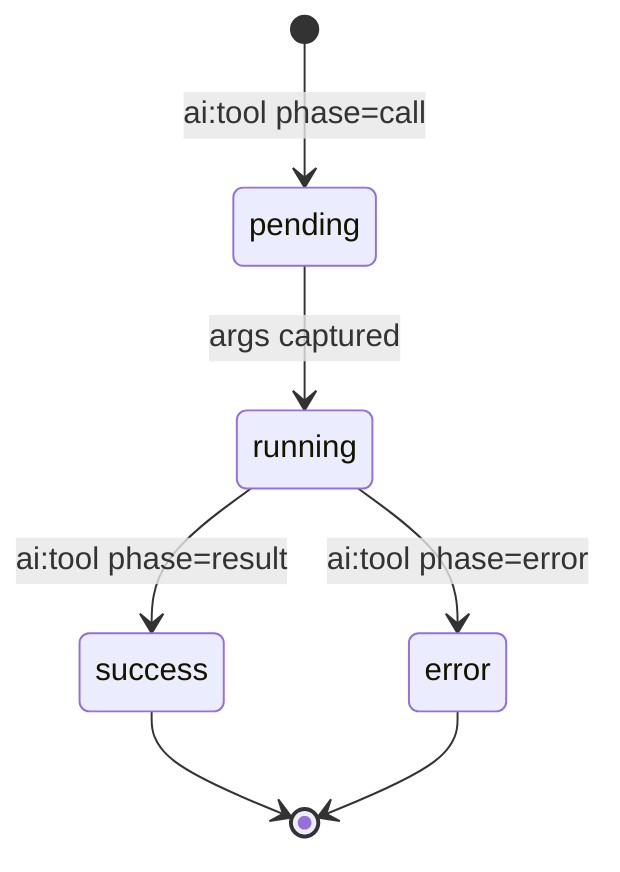
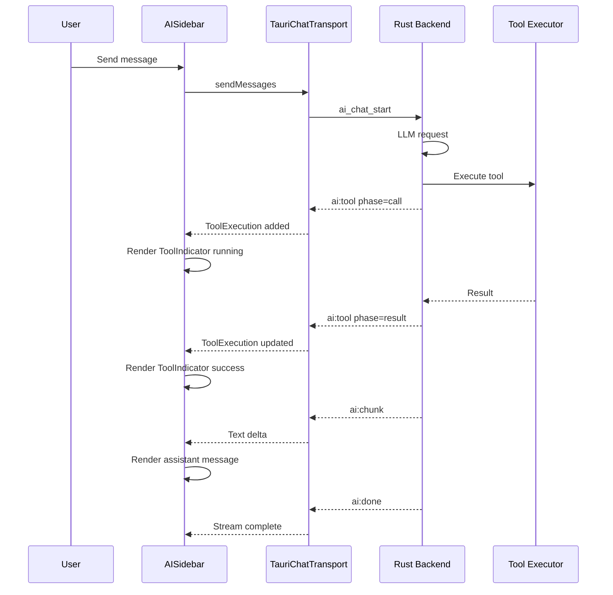

# AI Tool Calling Architecture

## Overview

This document describes the architecture for adding parallel tool calling support and visual indicators to the AI chat sidebar. The backend already emits `ai:tool` events during tool execution; the frontend needs to capture these events and display real-time tool status to users.

## Current State Analysis

### Backend (Already Implemented)

The Rust backend in [`src-tauri/src/ai/agent.rs`](src-tauri/src/ai/agent.rs) runs an agent loop that:

1. Calls the LLM provider with tool protocol enabled
2. Parses responses for tool calls
3. Executes tools sequentially via [`execute_tool_call()`](src-tauri/src/ai/tools.rs)
4. Emits `ai:tool` events for each phase: `call`, `result`, `error`
5. Continues the loop until a final response or cap is reached

**Event Structure** from [`src-tauri/src/ai/types.rs:83-94`](src-tauri/src/ai/types.rs:83):

```rust
pub struct AiToolEvent {
    pub job_id: String,
    pub tool: String,
    pub phase: String,        // "call" | "result" | "error"
    pub call_id: Option<String>,
    pub payload: Option<Value>,
    pub error: Option<String>,
}
```

### Frontend Gaps

1. **No `ai:tool` listener** - The [`TauriChatTransport`](src/lib/ai/tauriChatTransport.ts) only listens to `ai:chunk`, `ai:done`, `ai:error`
2. **No tool state tracking** - No UI state for tool executions
3. **No visual indicators** - Users see no feedback during tool execution

---

## Architecture Design

### 1. Type Definitions

Add to [`src/components/ai/types.ts`](src/components/ai/types.ts):

```typescript
/**
 * Tool event payload from backend
 * Matches Rust AiToolEvent structure
 */
export interface AiToolEventPayload {
  job_id: string;
  tool: string;
  phase: "call" | "result" | "error";
  call_id?: string;
  payload?: unknown;
  error?: string;
}

/**
 * Tool execution phase for UI state
 */
export type ToolPhase = "pending" | "running" | "success" | "error";

/**
 * UI representation of a tool execution
 * Tracks the lifecycle of a single tool call
 */
export interface ToolExecution {
  /** Unique ID for React keys - uses call_id or generated fallback */
  id: string;
  /** Tool name: search_vault, list_files, read_file */
  tool: string;
  /** Current phase in UI state machine */
  phase: ToolPhase;
  /** Arguments passed to the tool */
  args?: unknown;
  /** Result payload on success */
  result?: unknown;
  /** Error message on failure */
  error?: string;
  /** Timestamp when tool was called */
  startedAt: number;
  /** Timestamp when tool completed */
  completedAt?: number;
}

/**
 * Map of job IDs to their active tool executions
 * Supports parallel tool tracking per job
 */
export type ToolExecutionsByJob = Map<string, ToolExecution[]>;
```

### 2. State Management Approach

#### Option A: Hook-Based State (Recommended)

Add tool state to the existing chat hook pattern:

```typescript
// In useAIChat.ts or a new useToolExecutions.ts hook
interface ToolExecutionsState {
  /** Current job's tool executions */
  tools: ToolExecution[];
  /** All tool executions indexed by job ID */
  byJob: ToolExecutionsByJob;
  /** Actions */
  clearTools: () => void;
  getToolsForJob: (jobId: string) => ToolExecution[];
}
```

#### State Machine Flow



#### Event Processing Logic

```typescript
function processToolEvent(
  event: AiToolEventPayload,
  currentTools: ToolExecution[],
): ToolExecution[] {
  const id = event.call_id ?? `${event.tool}-${Date.now()}`;

  switch (event.phase) {
    case "call":
      // New tool call - add to array
      return [
        ...currentTools,
        {
          id,
          tool: event.tool,
          phase: "running",
          args: event.payload,
          startedAt: Date.now(),
        },
      ];

    case "result":
      // Tool succeeded - update existing
      return currentTools.map((t) =>
        t.tool === event.tool && t.phase === "running"
          ? {
              ...t,
              phase: "success",
              result: event.payload,
              completedAt: Date.now(),
            }
          : t,
      );

    case "error":
      // Tool failed - update existing
      return currentTools.map((t) =>
        t.tool === event.tool && t.phase === "running"
          ? {
              ...t,
              phase: "error",
              error: event.error,
              completedAt: Date.now(),
            }
          : t,
      );
  }
}
```

### 3. Component Hierarchy

```
AISidebar.tsx
├── aiSidebarHeader
├── aiSidebarBody
│   ├── aiChatThread
│   │   ├── ChatMessage (user)
│   │   ├── ChatMessage (assistant)
│   │   │   └── ToolIndicatorGroup
│   │   │       └── ToolIndicator (per tool)
│   │   │           ├── ToolHeader (name + status icon)
│   │   │           └── ToolResult (collapsible)
│   │   └── ...
│   └── aiChatComposer
└── ...
```

### 4. Component Interfaces

#### ToolIndicator Props

```typescript
interface ToolIndicatorProps {
  /** Tool execution data */
  execution: ToolExecution;
  /** Whether result section is expanded */
  defaultExpanded?: boolean;
  /** Compact mode for inline display */
  compact?: boolean;
}
```

#### ToolIndicatorGroup Props

```typescript
interface ToolIndicatorGroupProps {
  /** All tool executions for current message */
  executions: ToolExecution[];
  /** Maximum tools to show before collapsing */
  maxVisible?: number;
}
```

### 5. CSS Module Structure

Create new file: `src/styles/app/07-ai-tool-indicator.css`

```css
/* ─────────────────────────────────────────────────────────────────────────────
   AI TOOL INDICATOR STYLES
   ───────────────────────────────────────────────────────────────────────────── */

/* Container for multiple tools */
.aiToolGroup {
  display: flex;
  flex-direction: column;
  gap: var(--space-2);
  margin-top: var(--space-2);
}

/* Single tool indicator */
.aiTool {
  border-radius: var(--radius-lg);
  border: 1px solid var(--border-light);
  background: color-mix(in srgb, var(--bg-secondary) 80%, transparent);
  overflow: hidden;
  transition:
    border-color var(--transition-base),
    background var(--transition-base);
}

/* Tool header row */
.aiToolHeader {
  display: flex;
  align-items: center;
  gap: var(--space-2);
  padding: var(--space-2) var(--space-3);
  cursor: pointer;
  user-select: none;
}

/* Tool name */
.aiToolName {
  font-size: var(--text-xs);
  font-weight: var(--font-medium);
  color: var(--text-secondary);
  font-family: var(--font-mono);
}

/* Status indicator dot */
.aiToolStatus {
  width: 8px;
  height: 8px;
  border-radius: 999px;
  flex-shrink: 0;
}

/* Phase-specific status colors */
.aiTool--running .aiToolStatus {
  background: var(--color-blue-500);
  animation: pulse 1.5s ease-in-out infinite;
}

.aiTool--success .aiToolStatus {
  background: var(--color-green-500);
}

.aiTool--error .aiToolStatus {
  background: var(--color-red-500);
}

/* Phase-specific container styles */
.aiTool--running {
  border-color: color-mix(
    in srgb,
    var(--color-blue-500) 30%,
    var(--border-light)
  );
  background: color-mix(in srgb, var(--color-blue-50) 50%, transparent);
}

.aiTool--success {
  border-color: color-mix(
    in srgb,
    var(--color-green-500) 20%,
    var(--border-light)
  );
  background: color-mix(in srgb, var(--color-green-100) 40%, transparent);
}

.aiTool--error {
  border-color: color-mix(
    in srgb,
    var(--color-red-500) 30%,
    var(--border-light)
  );
  background: color-mix(in srgb, var(--color-red-100) 50%, transparent);
}

/* Expandable result section */
.aiToolResult {
  padding: var(--space-2) var(--space-3);
  padding-top: 0;
  font-size: var(--text-xs);
  font-family: var(--font-mono);
  color: var(--text-tertiary);
  max-height: 200px;
  overflow: auto;
  white-space: pre-wrap;
  word-break: break-word;
}

/* Expand/collapse chevron */
.aiToolChevron {
  margin-left: auto;
  transition: transform var(--transition-base);
}

.aiTool[data-expanded="true"] .aiToolChevron {
  transform: rotate(180deg);
}

/* Animation for running state */
@keyframes pulse {
  0%,
  100% {
    opacity: 1;
  }
  50% {
    opacity: 0.5;
  }
}

/* Dark mode adjustments */
@media (prefers-color-scheme: dark) {
  .aiTool--running {
    background: color-mix(in srgb, var(--color-blue-500) 12%, transparent);
  }

  .aiTool--success {
    background: color-mix(in srgb, var(--color-green-500) 12%, transparent);
  }

  .aiTool--error {
    background: color-mix(in srgb, var(--color-red-500) 12%, transparent);
  }
}
```

### 6. Integration Points

#### A. TauriChatTransport Enhancement

Modify [`src/lib/ai/tauriChatTransport.ts`](src/lib/ai/tauriChatTransport.ts) to emit tool events:

```typescript
// Add to the ReadableStream start function
const unlistenTool = await listenTauriEvent("ai:tool", (payload) => {
  if (payload.job_id !== jobId) return;
  // Emit custom event or call callback
  controller.enqueue({
    type: "tool",
    ...payload,
  } as UIMessageChunk);
});
cleanupFns.push(unlistenTool);
```

**Note**: The AI SDK's `UIMessageChunk` type may need extension or we use a separate callback pattern.

#### B. AISidebar Integration

Modify [`src/components/ai/AISidebar.tsx`](src/components/ai/AISidebar.tsx):

```typescript
// Add tool state
const [toolExecutions, setToolExecutions] = useState<ToolExecution[]>([]);

// Listen to tool events via transport or direct Tauri event
useTauriEvent("ai:tool", (payload) => {
  if (payload.job_id !== currentJobId) return;
  setToolExecutions((prev) => processToolEvent(payload, prev));
});

// Clear tools on new message
const handleSend = async () => {
  setToolExecutions([]);
  // ... existing send logic
};

// Render tools in message thread
{chat.messages.map((m) => (
  <div key={m.id} className="aiChatMsg">
    <div className="aiChatContent">{messageText(m)}</div>
    {m.role === "assistant" && toolExecutions.length > 0 && (
      <ToolIndicatorGroup executions={toolExecutions} />
    )}
  </div>
))}
```

#### C. useAIChat Hook Enhancement

For the legacy hook in [`src/components/ai/hooks/useAIChat.ts`](src/components/ai/hooks/useAIChat.ts):

```typescript
// Add to UseAIChatResult interface
export interface UseAIChatResult {
  // ... existing fields
  toolExecutions: ToolExecution[];
}

// Add to hook implementation
const [toolExecutions, setToolExecutions] = useState<ToolExecution[]>([]);

const onTool = useCallback((payload: AiToolEventPayload) => {
  if (payload.job_id !== jobIdRef.current) return;
  setToolExecutions((prev) => processToolEvent(payload, prev));
}, []);

useTauriEvent("ai:tool", onTool);

// Clear on new request
const startRequest = useCallback(
  async (userText: string) => {
    setToolExecutions([]);
    // ... existing logic
  },
  [
    /* deps */
  ],
);
```

---

## File Structure

### New Files

```
src/
├── components/
│   └── ai/
│       ├── ToolIndicator.tsx       # Tool status component
│       └── ToolIndicatorGroup.tsx  # Container for multiple tools
├── styles/
│   └── app/
│       └── 07-ai-tool-indicator.css # Tool indicator styles
```

### Modified Files

```
src/
├── components/
│   └── ai/
│       ├── types.ts                # Add tool-related types
│       ├── AISidebar.tsx           # Integrate tool indicators
│       └── hooks/
│           └── useAIChat.ts        # Add tool state management
├── lib/
│   └── ai/
│       └── tauriChatTransport.ts   # Add ai:tool listener
└── styles/
    └── app/
        └── index.css               # Import new tool indicator CSS
```

---

## Implementation Checklist

### Phase 1: Type Definitions

- [ ] Add `AiToolEventPayload` interface to types.ts
- [ ] Add `ToolPhase` type union
- [ ] Add `ToolExecution` interface
- [ ] Export new types from index.ts

### Phase 2: State Management

- [ ] Create `processToolEvent()` utility function
- [ ] Add `toolExecutions` state to useAIChat hook
- [ ] Add `useTauriEvent("ai:tool", ...)` listener
- [ ] Clear tool state on new requests

### Phase 3: UI Components

- [ ] Create `ToolIndicator.tsx` component
- [ ] Create `ToolIndicatorGroup.tsx` component
- [ ] Add animation variants using `springPresets.snappy`
- [ ] Implement collapsible result preview

### Phase 4: Styling

- [ ] Create `07-ai-tool-indicator.css`
- [ ] Add phase-specific color schemes
- [ ] Add pulse animation for running state
- [ ] Add dark mode variants

### Phase 5: Integration

- [ ] Integrate ToolIndicatorGroup into AISidebar
- [ ] Integrate into legacy ChatMessages if needed
- [ ] Test with all three tools: search_vault, list_files, read_file
- [ ] Verify event cleanup on unmount

---

## Design Tokens Reference

From [`src/design-tokens.css`](src/design-tokens.css):

| Token               | Value   | Usage                        |
| ------------------- | ------- | ---------------------------- |
| `--radius-lg`       | 10px    | Tool container border radius |
| `--space-2`         | 8px     | Internal padding/gaps        |
| `--space-3`         | 12px    | Header padding               |
| `--text-xs`         | 11px    | Tool name, result text       |
| `--text-sm`         | 12px    | Message content              |
| `--transition-base` | 150ms   | Expand/collapse transitions  |
| `--color-blue-50`   | #e8f4fc | Running state background     |
| `--color-green-100` | #e6f6e9 | Success state background     |
| `--color-red-100`   | #fce8e8 | Error state background       |

Animation preset from [`src/components/ui/animations.ts`](src/components/ui/animations.ts):

```typescript
springPresets.snappy; // { type: "spring", stiffness: 500, damping: 30 }
```

---

## Event Flow Diagram



---

## Considerations

### Performance

- Tool results can be large (up to 120KB per backend limit)
- Consider truncating display in UI
- Use virtualization if many tools in single conversation

### Accessibility

- Add `aria-live="polite"` for tool status updates
- Ensure color is not the only indicator (use icons + text)
- Keyboard navigation for expand/collapse

### Error Handling

- Display user-friendly error messages
- Allow retry for failed tools (future enhancement)
- Log errors for debugging

### Future Enhancements

- Tool result caching for re-run
- Inline tool approval for sensitive operations
- Custom tool definitions from plugins
