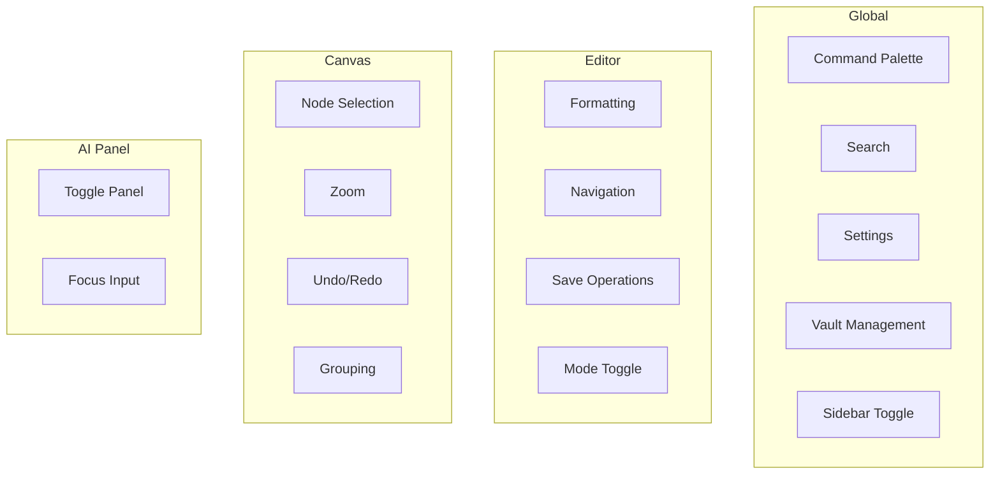
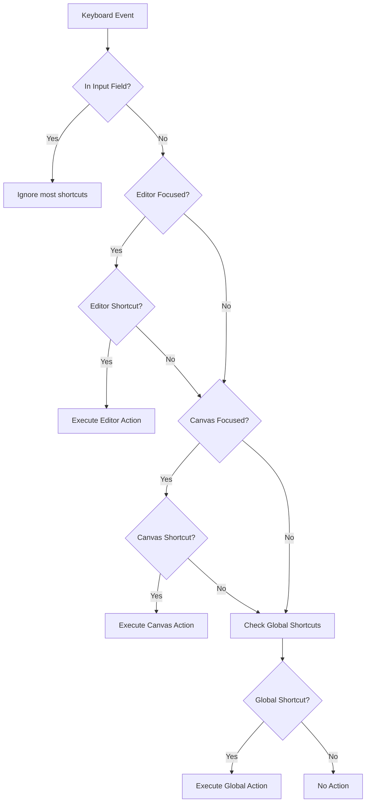

# Keyboard Shortcuts System Design

## Overview

This document outlines a comprehensive keyboard shortcuts system for Glyph, a desktop note-taking app with a node-based canvas editor. The design builds upon existing infrastructure while introducing a more organized, extensible approach to shortcut management.

## Current State Analysis

### Existing Infrastructure

| File                                                                             | Purpose                                                                               |
| -------------------------------------------------------------------------------- | ------------------------------------------------------------------------------------- |
| [`src/lib/shortcuts.ts`](src/lib/shortcuts.ts)                                   | `Shortcut` type definition, `isShortcutMatch()` matcher, `formatShortcut()` formatter |
| [`src/hooks/useCommandShortcuts.ts`](src/hooks/useCommandShortcuts.ts)           | Global keyboard event handler, command palette integration                            |
| [`src/components/app/CommandPalette.tsx`](src/components/app/CommandPalette.tsx) | Displays commands with shortcuts, `Command` interface                                 |
| [`src/components/app/AppShell.tsx`](src/components/app/AppShell.tsx:309)         | Command definitions and shortcut registration                                         |

### Current Shortcuts

| Shortcut | Action               | Context    |
| -------- | -------------------- | ---------- |
| `⌘K`     | Open command palette | Global     |
| `⌘⇧P`    | Open command palette | Global     |
| `⌘F`     | Open search palette  | Global     |
| `⌘,`     | Open settings        | Global     |
| `⌘O`     | Open vault           | Global     |
| `⌘⇧A`    | Toggle AI panel      | Vault open |
| `⌘N`     | New note             | Vault open |

---

## Shortcuts Registry

### Navigation Shortcuts

| Shortcut | Action          | Description                         | Context    | Status   |
| -------- | --------------- | ----------------------------------- | ---------- | -------- |
| `⌘B`     | Toggle sidebar  | Show/hide the file tree sidebar     | Global     | **New**  |
| `⌘⇧A`    | Toggle AI panel | Show/hide the AI assistant panel    | Vault open | Existing |
| `⌘⇧E`    | Focus file tree | Move focus to the file tree sidebar | Vault open | **New**  |
| `⌘⇧G`    | Focus canvas    | Move focus to the main canvas area  | Vault open | **New**  |

### File Operations

| Shortcut | Action         | Description                             | Context                     | Status   |
| -------- | -------------- | --------------------------------------- | --------------------------- | -------- |
| `⌘N`     | New note       | Create a new note in current folder     | Vault open                  | Existing |
| `⌘S`     | Save note      | Save current note if modified           | Editor focused, has changes | **New**  |
| `⌘⇧N`    | New folder     | Create a new folder in current location | Vault open                  | **New**  |
| `⌘D`     | Duplicate note | Duplicate the current note              | Note selected               | **New**  |
| `⌘⌫`     | Delete note    | Move current note to trash              | Note selected               | **New**  |
| `⌘⇧R`    | Rename         | Rename selected file/folder             | File/folder selected        | **New**  |

### Search & Command Palette

| Shortcut | Action           | Description                          | Context       | Status   |
| -------- | ---------------- | ------------------------------------ | ------------- | -------- |
| `⌘K`     | Command palette  | Open the command palette             | Global        | Existing |
| `⌘⇧P`    | Command palette  | Open the command palette (alternate) | Global        | Existing |
| `⌘F`     | Search           | Open search in command palette       | Global        | Existing |
| `⌘⇧F`    | Search in folder | Search within current folder         | Vault open    | **New**  |
| `⌘G`     | Find next        | Jump to next search result           | Search active | **New**  |
| `⌘⇧G`    | Find previous    | Jump to previous search result       | Search active | **New**  |

### Editor Shortcuts

| Shortcut | Action               | Description                           | Context            | Status  |
| -------- | -------------------- | ------------------------------------- | ------------------ | ------- |
| `⌘⇧M`    | Toggle markdown mode | Switch between rich text and markdown | Editor focused     | **New** |
| `⌘⌥C`    | Copy as markdown     | Copy selection as markdown            | Editor focused     | **New** |
| `⌘⌥V`    | Paste as markdown    | Paste clipboard as markdown           | Editor focused     | **New** |
| `⌘/`     | Toggle comment       | Comment/uncomment selected lines      | Code block focused | **New** |
| `⌘⌥↓`    | Move line down       | Move current line down                | Editor focused     | **New** |
| `⌘⌥↑`    | Move line up         | Move current line up                  | Editor focused     | **New** |

### Formatting Shortcuts (Editor Only)

| Shortcut | Action        | Description                 | Context        | Status  |
| -------- | ------------- | --------------------------- | -------------- | ------- |
| `⌘B`     | Bold          | Toggle bold formatting      | Editor focused | **New** |
| `⌘I`     | Italic        | Toggle italic formatting    | Editor focused | **New** |
| `⌘U`     | Underline     | Toggle underline formatting | Editor focused | **New** |
| `⌘⇧X`    | Strikethrough | Toggle strikethrough        | Editor focused | **New** |
| `⌘⇧C`    | Code inline   | Toggle inline code          | Editor focused | **New** |
| `⌘⌥1-6`  | Heading 1-6   | Set heading level           | Editor focused | **New** |
| `⌘⇧L`    | Toggle list   | Toggle bullet/numbered list | Editor focused | **New** |
| `⌘⇧Q`    | Blockquote    | Toggle blockquote           | Editor focused | **New** |
| `⌘⌥C`    | Code block    | Insert code block           | Editor focused | **New** |
| `⌘K`     | Insert link   | Insert/edit link            | Editor focused | **New** |

### Canvas Shortcuts

| Shortcut | Action           | Description                | Context        | Status  |
| -------- | ---------------- | -------------------------- | -------------- | ------- |
| `⌘A`     | Select all nodes | Select all nodes on canvas | Canvas focused | **New** |
| `⌘D`     | Duplicate nodes  | Duplicate selected nodes   | Canvas focused | **New** |
| `⌘G`     | Group nodes      | Group selected nodes       | Canvas focused | **New** |
| `⌘⇧G`    | Ungroup          | Ungroup selected group     | Canvas focused | **New** |
| `⌘Z`     | Undo             | Undo last canvas action    | Canvas focused | **New** |
| `⌘⇧Z`    | Redo             | Redo last undone action    | Canvas focused | **New** |
| `Delete` | Delete nodes     | Delete selected nodes      | Canvas focused | **New** |
| `⌘+`     | Zoom in          | Zoom canvas in             | Canvas focused | **New** |
| `⌘-`     | Zoom out         | Zoom canvas out            | Canvas focused | **New** |
| `⌘0`     | Zoom reset       | Reset canvas zoom to 100%  | Canvas focused | **New** |
| `⌘⇧[`    | Send backward    | Send node behind others    | Canvas focused | **New** |
| `⌘⇧]`    | Bring forward    | Bring node in front        | Canvas focused | **New** |

### Window & App Shortcuts

| Shortcut | Action        | Description                | Context   | Status   |
| -------- | ------------- | -------------------------- | --------- | -------- |
| `⌘,`     | Settings      | Open settings window       | Global    | Existing |
| `⌘O`     | Open vault    | Open an existing vault     | Global    | Existing |
| `⌘⇧O`    | New vault     | Create a new vault         | Global    | **New**  |
| `⌘W`     | Close preview | Close current preview/note | Note open | **New**  |
| `⌘Q`     | Quit          | Quit the application       | Global    | System   |
| `⌘H`     | Hide          | Hide the application       | Global    | System   |
| `⌘M`     | Minimize      | Minimize the window        | Global    | System   |

---

## Shortcut Categories



### Priority Matrix

| Priority | Category          | Rationale                          |
| -------- | ----------------- | ---------------------------------- |
| P0       | Global Navigation | Core app navigation, highest usage |
| P0       | File Operations   | Essential for note management      |
| P1       | Editor Formatting | Frequent use during writing        |
| P1       | Canvas Operations | Core canvas functionality          |
| P2       | AI Panel          | Secondary feature                  |
| P2       | Advanced Editor   | Power user features                |

---

## Implementation Approach

### 1. Centralized Shortcuts Constants File

Create a new file [`src/lib/shortcuts/registry.ts`](src/lib/shortcuts/registry.ts) to define all shortcuts in one place:

```typescript
// src/lib/shortcuts/registry.ts
import type { Shortcut } from "./types";

export interface ShortcutDefinition {
  id: string;
  shortcut: Shortcut;
  label: string;
  description: string;
  category: "navigation" | "file" | "search" | "editor" | "canvas" | "window";
  context: "global" | "vault" | "editor" | "canvas";
  enabled?: () => boolean;
}

export const SHORTCUTS: ShortcutDefinition[] = [
  // Navigation
  {
    id: "toggle-sidebar",
    shortcut: { meta: true, key: "b" },
    label: "Toggle Sidebar",
    description: "Show or hide the file tree sidebar",
    category: "navigation",
    context: "global",
  },
  // ... more shortcuts
];
```

### 2. Context-Aware Shortcut Handling

Extend the existing [`useCommandShortcuts`](src/hooks/useCommandShortcuts.ts) hook to handle different contexts:

```typescript
// src/hooks/useCommandShortcuts.ts
interface ShortcutContext {
  isEditorFocused: boolean;
  isCanvasFocused: boolean;
  isVaultOpen: boolean;
  hasUnsavedChanges: boolean;
}

function getActiveContext(): ShortcutContext {
  // Determine current context based on DOM state
  const activeElement = document.activeElement;
  const isEditorFocused =
    activeElement?.closest(".tiptapContentInline") != null;
  const isCanvasFocused = activeElement?.closest(".react-flow") != null;

  return {
    isEditorFocused,
    isCanvasFocused,
    isVaultOpen: Boolean(vaultPath),
    hasUnsavedChanges: false, // From editor state
  };
}
```

### 3. Shortcut Conflict Resolution

When the same shortcut exists in different contexts, use this priority:

1. **Input fields** - Shortcuts ignored except Escape
2. **Editor** - Editor-specific shortcuts take precedence
3. **Canvas** - Canvas-specific shortcuts take precedence
4. **Global** - Fallback to global shortcuts



### 4. Platform Abstraction

Create a platform-aware shortcut formatter:

```typescript
// src/lib/shortcuts/platform.ts
import { platform } from "@tauri-apps/plugin-os";

export function getPlatformModifier(): "meta" | "ctrl" {
  const p = platform();
  return p === "macos" ? "meta" : "ctrl";
}

export function formatShortcutForPlatform(shortcut: Shortcut): string {
  const p = platform();
  const isMac = p === "macos";

  const parts: string[] = [];

  if (shortcut.meta) parts.push(isMac ? "⌘" : "Ctrl+");
  if (shortcut.ctrl) parts.push(isMac ? "⌃" : "Ctrl+");
  if (shortcut.alt) parts.push(isMac ? "⌥" : "Alt+");
  if (shortcut.shift) parts.push(isMac ? "⇧" : "Shift+");

  parts.push(
    shortcut.key.length === 1 ? shortcut.key.toUpperCase() : shortcut.key,
  );

  return parts.join(isMac ? "" : "+");
}
```

### 5. User Communication

#### Command Palette Integration

Shortcuts are already displayed in the command palette. Enhance with category grouping:

```typescript
// Group commands by category in CommandPalette
const groupedCommands = useMemo(() => {
  return commands.reduce(
    (acc, cmd) => {
      const category = cmd.category || "general";
      if (!acc[category]) acc[category] = [];
      acc[category].push(cmd);
      return acc;
    },
    {} as Record<string, Command[]>,
  );
}, [commands]);
```

#### Keyboard Shortcut Help Panel

Add a help command that displays all shortcuts:

```typescript
{
  id: 'show-shortcuts',
  label: 'Show Keyboard Shortcuts',
  shortcut: { meta: true, key: '/' },
  action: () => openShortcutsHelp(),
}
```

#### Settings Page

Add a Keyboard Shortcuts section in settings where users can:

- View all shortcuts organized by category
- Search for specific shortcuts
- See platform-specific key combinations

---

## Platform Considerations

### Key Mapping

| macOS         | Windows/Linux | Notes                     |
| ------------- | ------------- | ------------------------- |
| `⌘` (Command) | `Ctrl`        | Primary modifier          |
| `⌥` (Option)  | `Alt`         | Secondary modifier        |
| `⇧` (Shift)   | `Shift`       | Same on both              |
| `⌃` (Control) | `Ctrl`        | Used differently on macOS |

### Platform-Specific Shortcuts

Some shortcuts should differ by platform to match native conventions:

| Action         | macOS | Windows/Linux |
| -------------- | ----- | ------------- |
| Toggle sidebar | `⌘B`  | `Ctrl+B`      |
| Save           | `⌘S`  | `Ctrl+S`      |
| Find           | `⌘F`  | `Ctrl+F`      |
| Settings       | `⌘,`  | `Ctrl+,`      |

### Reserved System Shortcuts

Avoid these shortcuts as they are reserved by the OS:

| macOS    | Windows/Linux | Purpose              |
| -------- | ------------- | -------------------- |
| `⌘Q`     | `Alt+F4`      | Quit application     |
| `⌘H`     | -             | Hide application     |
| `⌘M`     | -             | Minimize window      |
| `⌘Tab`   | `Alt+Tab`     | Application switcher |
| `⌘Space` | `Win`         | System search        |

---

## Implementation Phases

### Phase 1: Foundation

- [ ] Create `src/lib/shortcuts/registry.ts` with shortcut definitions
- [ ] Create `src/lib/shortcuts/platform.ts` for platform abstraction
- [ ] Create `src/lib/shortcuts/context.ts` for context detection
- [ ] Update `Shortcut` type to include `id` and `category`

### Phase 2: Core Shortcuts

- [ ] Add sidebar toggle shortcut (`⌘B`)
- [ ] Add save shortcut (`⌘S`) with dirty state detection
- [ ] Add new folder shortcut (`⌘⇧N`)
- [ ] Add rename shortcut (`⌘⇧R`)

### Phase 3: Editor Shortcuts

- [ ] Add formatting shortcuts (bold, italic, etc.)
- [ ] Add markdown mode toggle (`⌘⇧M`)
- [ ] Add line movement shortcuts

### Phase 4: Canvas Shortcuts

- [ ] Add node selection shortcuts
- [ ] Add zoom shortcuts
- [ ] Add undo/redo integration

### Phase 5: User Experience

- [ ] Add keyboard shortcuts help panel
- [ ] Add shortcuts to settings page
- [ ] Add category grouping to command palette

---

## File Structure

```
src/lib/shortcuts/
├── index.ts          # Public exports
├── types.ts          # Type definitions
├── registry.ts       # Shortcut definitions
├── platform.ts       # Platform-specific formatting
├── context.ts        # Context detection utilities
└── matching.ts       # Shortcut matching logic

src/hooks/
├── useCommandShortcuts.ts    # Global shortcut handler (existing)
├── useEditorShortcuts.ts     # Editor-specific shortcuts (new)
└── useCanvasShortcuts.ts     # Canvas-specific shortcuts (new)
```

---

## Questions for Consideration

1. **Sidebar toggle shortcut**: The user suggested `⌘⇧S`, `⌘B`, or `⌘\`.
   - `⌘B` conflicts with bold formatting in editor context
   - `⌘⇧S` could conflict with "Save As" in some apps
   - `⌘\` is less common but avoids conflicts
   - **Recommendation**: Use `⌘B` globally, but in editor context, bold takes precedence. Users can still toggle sidebar via menu or command palette when in editor.

2. **Save shortcut behavior**: Should `⌘S` always save, or only when there are unsaved changes?
   - **Recommendation**: Always enabled but shows visual feedback when no changes to save.

3. **Custom shortcuts**: Should users be able to customize shortcuts?
   - **Recommendation**: Not in initial implementation. Can be added later if requested.

---

## Summary

This design provides a comprehensive keyboard shortcuts system that:

1. **Organizes shortcuts** into logical categories with clear context boundaries
2. **Extends existing infrastructure** without major refactoring
3. **Supports cross-platform** usage with proper key mapping
4. **Provides user discoverability** through command palette and help panels
5. **Handles context conflicts** with a clear priority system

The implementation can be phased in gradually, starting with the most impactful shortcuts (sidebar toggle, save) and expanding to cover editor and canvas operations.
